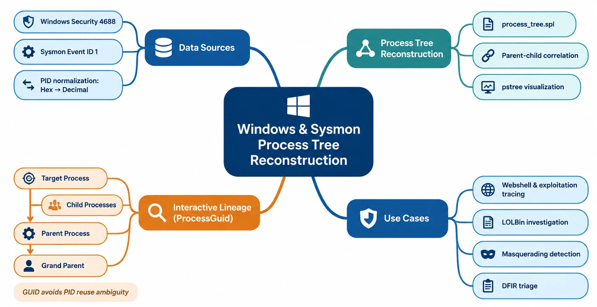

  

[-blue)](#)

# Windows & Sysmon Process Tree Reconstruction & Interactive Lineage Suite (Classic Dashboard SPL)

A production-ready Splunk SPL query and dashboard suite designed for **Classic Dashboards** to reconstruct Parent-Child process execution lineages using both native Windows Security auditing and Sysmon event logs.

It provides two complementary investigative capabilities:
1. **Full Process Tree Reconstruction**: An aggregated execution tree reconciling native Windows and Sysmon telemetry.
2. **Context-Driven Interactive Lineage Investigation**: A 4-stage drilldown workflow traversing execution lineage (Process -> Parent -> Grand Parent -> Child) using globally unique Sysmon GUIDs to eliminate PID reuse ambiguity.

---

## 🎯 Use Case & Forensic Purpose

During alert triage and DFIR investigations, analysts need to see the entire execution hierarchy of an endpoint rather than isolated events:
* **Webshell & Exploitation Tracing**: Detecting abnormal parentage like `w3wp.exe` spawning compilers (`csc.exe`) or command shells (`cmd.exe`, `powershell.exe`).
* **LOLBin Activity**: Tracing Living-off-the-Land binaries and their argument payloads.
* **Privilege Context**: Correlating executing users and command-line parameters across the process lineage.
* **PID Reuse Elimination**: Leveraging Sysmon `ProcessGuid` across interactive drilldown stages to prevent forensic confusion caused by transient or recycled Windows process IDs.

---

## 🎯 MITRE ATT&CK Coverage

| Tactic | Technique ID | Technique Name | Detection Context |
| :--- | :--- | :--- | :--- |
| **Execution** | [T1059](https://attack.mitre.org/techniques/T1059/) | Command and Scripting Interpreter | PowerShell, CMD, WScript execution tracking |
| **Defense Evasion** | [T1036](https://attack.mitre.org/techniques/T1036/) | Masquerading | Renamed binaries via `OriginalFileName` validation |
| **Defense Evasion** | [T1027](https://attack.mitre.org/techniques/T1027/) | Obfuscated Files or Information | Base64/encoded arguments exposed in `CommandLine` |
| **Persistence / Privilege Escalation** | [T1543](https://attack.mitre.org/techniques/T1543/) | Create or Modify System Process | Services spawning unexpected parentage |

---

## 📚 Recommended Reading

For a deeper understanding of the tradecraft, methodology, and the "why" behind process tree analysis:
* [Process Hunting with a Process Tree](https://www.splunk.com/en-us/blog/security/process-hunting-with-a-process.html) - Splunk blog post exploring execution visibility in SOC operations.

---

## ⚙️ Data Sources & Event IDs

| Data Source | EventCode | Key Ingested Fields |
| :--- | :--- | :--- |
| Microsoft Windows Security | 4688 | `process_id` (Hex), `parent_process_id` (Hex), `process_path` |
| Microsoft-Windows-Sysmon | 1 | `CommandLine`, `OriginalFileName`, `user`, `ProcessGuid`, `ParentProcessGuid`, `ParentImage` |

---

## 🧩 Technical Highlights

1. **Dual-Source Correlation**: Integrates Windows `4688` and Sysmon `1` into a single, cohesive timeline.
2. **Hex-to-Dec PID Normalization**: Windows `4688` logs PIDs in hexadecimal (`0x27244`), whereas Sysmon and SOC analysts typically reference decimal integers. The query uses `tonumber(..., 16)` to normalize PIDs for accurate parent-child matching.
3. **PE Masquerading Mitigation**: Inspects `OriginalFileName` to catch renamed binaries attempting defense evasion.
4. **Visual Hierarchy**: Utilizes the `pstree` custom command to render structured tree branches directly in a dashboard table.
5. **Dynamic Drilldown Traversal**: Employs Simple XML drilldown tokens to transition smoothly from an anomalous process to its parent, grand parent, and downstream child processes.

---

## 🧠 Technical Deep Dive: process_tree.spl Logic

This section provides a granular breakdown of the SPL execution pipeline to assist analysts in debugging or extending the query.

### 1. Data Ingestion & Noise Suppression
The query begins by aggregating process creation events from two primary telemetry sources:
* **EventCode 4688**: Native Windows Security Auditing.
* **EventCode 1**: Microsoft Sysmon.
* **Exclusion Layer**: A mandatory filter `parent_process_name!="*splunkd.exe*"` is applied early in the pipeline to prevent the search from being flooded by Splunk internal agent activity, ensuring only relevant system/user activity is analyzed.

### 2. Advanced Regex Token Handling
Dynamic Regex Translation is used for tokens (`$TOKEN_PROCESS_PATH$` and `$TOKEN_PROCESS_ID$`):
* **Wildcard Support**: Converts standard wildcards (`*`) to `.*` via `replace()`.
* **Path Escaping**: Handles Windows backslashes (`\\\\` to `\\\\\\\\`) and strips whitespace.
* **Case Insensitivity**: Applies `(?i)` flag across path filters.

### 3. PID & Field Normalization (The Multi-Source Bridge)
* **Hex-to-Dec Conversion**: Standardizes Windows hex PIDs (`0x1a4`) into decimal integers via `tonumber(process_id, 16)`, enabling accurate `stats` grouping and parent-child matching.
* **Command Line Coalescing**: Uses `coalesce(Process_Command_Line, CommandLine)` to unify disparate schema field names across sources.

### 4. Forensic Enrichment & Masquerading Detection
* **Binary Isolation**: Strips full directory paths to isolate executable names (`ProcessName`).
* **Masquerading Detection**: Compares `OriginalFileName` with the active executable name to catch defense evasion attempts (e.g., renaming `powershell.exe` to `calc.exe`).

### 5. Data Aggregation & Multi-Value Management
* **Timeline Preservation**: Preserves timestamps with `max(_time)`.
* **Context Concatenation**: Combines multi-source values with `mvjoin(EventCode, ",")` and `mvjoin(User, " / ")` to retain full context without row explosion.

### 6. Recursive Tree Reconstruction
* **Node Construction**: Creates unique node identifiers (`cmd.exe (PID: 4432)`).
* **Visualization**: Uses `pstree` to recursively assemble the execution hierarchy with command-line context (`spaces=60`).

---

## 🧭 Interactive Lineage Investigation Panels

The suite includes 4 interactive Simple XML panels that traverse execution hierarchy using Sysmon **ProcessGuid** instead of volatile PIDs:

| Stage | Panel Title | Source File | Trigger Token | Output Token | Description |
| :--- | :--- | :--- | :--- | :--- | :--- |
| **Stage 1** | Target Process | [`sysmon-process.xml`](./sysmon-process.xml) | Form Inputs | `$GAPGPTMASKTOKENvat2frx3tkeX0X$` | Entry point: Filter by Image, Host, or GUID. Clicking sets target GUID. |
| **Stage 2** | Parent Process | [`sysmon-parent.xml`](./sysmon-parent.xml) | `$GAPGPTMASKTOKENvat2frx3tkeX1X$` | `$GAPGPTMASKTOKENvat2frx3tkeX2X$` | Resolves immediate parent binary and parent GUID. |
| **Stage 3** | Grand Parent Process | [`sysmon-grand-parent.xml`](./sysmon-grand-parent.xml) | `$GAPGPTMASKTOKENvat2frx3tkeX3X$` | None (Terminal) | Traces root execution ancestor (e.g., service, launcher, shell). |
| **Stage 4** | Child Processes | [`sysmon-child.xml`](./sysmon-child.xml) | `$GAPGPTMASKTOKENvat2frx3tkeX4X$` | None (Downstream) | Surfaces all binaries and commands spawned by the target process. |

### Investigation Drilldown Flow

1. **Target Identification** (`sysmon-process.xml`):
   * Analyst identifies and clicks a suspicious process row.
   * Simple XML sets token `$GAPGPTMASKTOKEN843jicv5stcX0X$` containing the target `ProcessGuid`.

2. **Parallel Lineage Investigation**:
   * **Upstream Investigation** (`sysmon-parent.xml`): Uses target `ProcessGuid` to locate the direct parent process.
   * **Downstream Investigation** (`sysmon-child.xml`): Uses target `ProcessGuid` as `ParentProcessGuid` to enumerate all executed child processes.

3. **Root Ancestor Resolution** (`sysmon-grand-parent.xml`):
   * Clicking a row in the parent panel sets token `$GAPGPTMASKTOKEN843jicv5stcX1X$` with the `ParentProcessGuid`.
   * Displays the grand parent process to identify the root execution source (e.g., service, shell, or malicious launcher).

---

## 📁 Repository Structure

* `process_tree.spl`: Primary SPL query for building recursive process trees using Sysmon EventCode 1.
* `sysmon-process.xml`: Initial triage panel. Filter by host, path, or PID to locate target executions.
* `sysmon-parent.xml`: Upstream panel. Resolves direct parent context via clicked target token.
* `sysmon-grand-parent.xml`: Root discovery panel. Traces ancestry back to initial launcher processes.
* `sysmon-child.xml`: Downstream panel. Lists all spawned subprocesses and downstream payload drops.

---

## 📋 Prerequisites & Dependencies

* **Splunk Environment**: Designed and tested for Splunk Enterprise using Classic (Simple XML) dashboards.
* **Add-on for Process Trees**:
  * The query inside `process_tree.spl` relies on the custom Splunk command `pstree`.
  * Download and install the app from Splunkbase: [Process Tree App (App 5721)](https://splunkbase.splunk.com/app/5721).
* **Native Drilldown Panels**: The 4 XML drilldown panels require **no custom add-ons**; they operate entirely on native Splunk search commands.
* **Data Sources**:
  * Sysmon Event ID 1 (Process Creation).
  * Recommended fields: `Host`, `ProcessId`, `ProcessGuid`, `ParentProcessId`, `ParentProcessGuid`, `Image`, `CommandLine`.

---

## ⚙️ Dashboard Inputs Configuration

Ensure your dashboard header form contains the following inputs:

* `time`: Time Range Picker (Default: Last 1 hour).
* `TOKEN_HOST`: Text input mapping to target host / workstation (Default: `*`).
* `TOKEN_PROCESS_PATH`: Text input for filtering executable names or path patterns (Default: `*`).
* `TOKEN_PROCESS_ID`: Text input for filtering by numerical Process ID (Default: `*`).
* `TOKEN_PROCESS_GUID`: Text input for filtering by Sysmon GUID (Default: `*`).

---

## 🚀 Deployment & Setup

1. **Create Dashboard**:
   * Navigate to **Search & Reporting** -> **Dashboards** -> **Create New Dashboard**.
   * Title the dashboard (e.g., `Sysmon Process Investigation Toolkit`).
   * Select **Classic Dashboards** as the layout engine.

2. **Configure XML Source**:
   * Click **Edit**, then select **Edit Source** to access the Simple XML definition.
   * Paste the input configuration tags and the panel definitions from the respective `.xml` files in this repository.

3. **Install Visual Tree View**:
   * Create a new single panel and paste the search query from `process_tree.spl`.
   * Set visualization to Table or custom view supported by the `pstree` app.

4. **Verify Field Mappings**:
   * Confirm that your index/sourcetype matches the queries.

